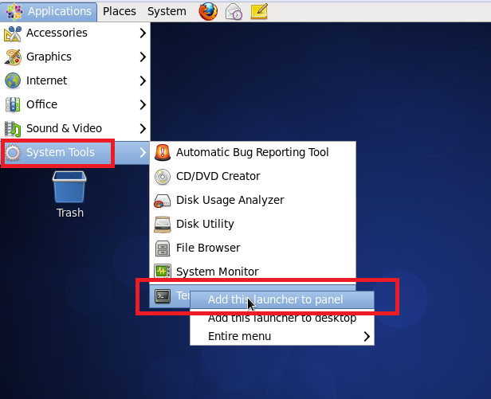

附录 安装CentOS 6.5 Linux操作系统
================================

在物理机、或者是在虚拟机中安装CentOS 6.5操作系统，均可参考以下安装步骤。
本书使用的Linux系统为**CentOS 6.5**。安装的ISO下载链接如下：

		http://isoredirect.centos.org/centos/6/isos/x86_64/

在这个链接中提供了众多的下载链接，只需要找到一个速度比较快的下载即可。下载完成之后，可以放到不同的介质上安装，比如U盘、DVD光盘。

确保下载的iso文件为：

		CentOS-6.5-x86_64-bin-DVD1.iso

安装CentOS较为熟悉的读者，可以只关注**粗体**步骤，不熟悉的读者请照步骤进行操作。

>* 本书所使用的**CentOS 6.5版本**，为了顺利地进行本书的所有实验，请读者务必采用此版本。

# 1.1 安装项
选择安装项,请选中第一项，然后回车。

图1.1 选择安装项

# 1.2 DVD检测
如果不想检测，可跳过（用方向键选中Skip，然后回车），毕竟检测会花遇较长时间，如图1.3所示。

图1.2 跳过DVD检测

# 1.3 安装界面
在此安装界面中，均可使用鼠标进行操作。点击Next按钮，

图1.3 安装界面

# 1.4 选择语言
为了减少在安装OpenStack包，由于语言本地化带来的问题，强烈建议选择**英文**。并且本书亦是使用系统语言为英语。默认选择的是英语，因此，只需要点击Next按钮。

图1.4 选择语言

## 1.5 选择键盘布局
中国大陆键盘布局一般默认使用美式键盘布局，除特殊布局外，一般使用默认选项，然后点击Next按钮。

图1.5 选择键盘布局

## 1.6 存储类型

一般而言，除非使用某种特殊的存储介质或者阵列，选择默认的Basic Storage Devices（如果是在虚拟机中安装CentOS，亦参照此步骤），然点击Next。

图1.6 选择存储类型

## 1.7 擦除数据
实际上，无论磁盘上是否有数据，均会出现如下界面，如果确认要在磁盘上安装CentOS系统，选择Yes, discard any data，点击之后，自动进入下一步（不用再点Next按钮）。

图1.7 擦除数据

##１.8 设置主机名
设置主机名时，请务必根据自己的需要设置一个略长一些的主机名，以免与其他服务器的主机名有冲突。

图1.8 设置主机名

## 1.9 选择时区
选择时区时，可以根据自己的需要来选择时区，**同一个OpenStack中的集群请选择相同的时区**。选择之后，点击Next按钮。

图1.9  选择时区

## 1.10 设置密码
输入两次相同密码之后，点击Next按钮。

图1.10 设置密码

如果输入的密码太简单，会跳出如图1.11所示对话框，如果确认要使用此密码，请点击Use Anyway。记务必记住此密码，否则无法正常登陆。

图1.11 使用简单密码

## 1.11 磁盘使用
安装时，由于**只有一个磁盘及分区**，因此在安装时，使用了**Use All Space**。

图1.12 使用所有的磁盘空间

>* 如果需要手动分区，请使用**Create Custom Layout**选项。
>* 如果读者磁盘上还有其他分区，具想保留这些分区，请参考网上安装Centos的上分区，以免数据丢失。
>* 选择**Use All Space**一定要**慎重**！仅适用于**不想保留磁盘**上的数据的情况！

完成之后，点击Next继续。此时，分区信息将会被写入到磁盘上，旧有的数据会被擦除，如果要继续，请点击Write changes to disk。

图1.13 写入分区至磁盘

## 1.12 服务器类型

接下来会选择安装的服务器类型，请务必选择Desktop。

图1.14 选择Desktop服务器类型。

## 1.13 安装系统
接下来将会进行系统的安装，以及各种rpm包。由于硬件的差异，会导致等待的时间长度有所不同，请耐心等待。

图1.15 安装系统

## 1.14 重启
安装完成之后，点击Reboot即可。如果是物理机，此时会弹出光驱，请取出DVD光盘，以便正常启动。

图1.16 重启

## 1.15 Welcom
重启完成之后，会出现如下Welcome界面，请点击Forward继续。

图1.17 Welcome

## 1.16 License
出现License界面，点击Forward继续。

图1.18 License

## 1.17 普通常用用户
设置普通常用用户名及密码。此处为非root用户。创建之后，点击Forward。如果密码过弱，会出现相应提示，可以点击Use anyway，否则请更改密码。

图1.19 创建普通常用用户

## 1.18 时间

根据所在地区设置时间，如果差异不大，可以不用更改，直接点击Forward。

图1.20 设置时间

## 1.19 Kdump

如果出现Kdump的提示，请点击OK，再点击Forward，再点击Finish。

图1.21 设置Kdump

## 1.20 登陆

登陆时选择创建的相应用户名，并且输入密码，即可正常登陆。

图1.22 登陆

## 1.21 终端快捷方式
为了更加方便地使用终端，可以考虑将终端放置于Panel上，或者在桌面创建快捷方式。

图1.23 设置终端

设置成功之后，将会在Panel上显示相应终端图标。

图1.24 将Terminal放置于Panel

至此，CentOS 6.5系统已经成功安装。