附录 virt-manager
======================

# 前提
进行本节内容之前，应该确认按照第一章《[由零开始](../chap1/index.md)》正确安装了virt-manager。以正确无误地进行本节的后续操作。

# 准备CentOS-6.5

将使用virt-manager安装的虚拟机，使用的Linux系统为**CentOS 6.5**。安装的ISO下载链接如下：

		http://isoredirect.centos.org/centos/6/isos/x86_64/

在这个链接中提供了众多的下载链接，只需要找到一个速度比较快的下载即可。下载完成之后，可以放到不同的介质上安装，比如U盘、DVD光盘。

确保下载的iso文件为：

		CentOS-6.5-x86_64-bin-DVD1.iso

安装CentOS较为熟悉的读者，可以只关注**粗体**步骤，不熟悉的读者请照步骤进行操作。

>* 本书所使用的**CentOS 6.5版本**，为了顺利地进行本书的所有实验，请读者务必采用此版本。

>* 如果已经准备好了`CentOS-6.5-x86_64-bin-DVD1.iso`，拷贝至运行virt-manager的物理机。放置于/cloud/_base目录下。

		# mkdir -p /cloud/_base
		拷贝CentOS-6.5-x86_64-bin-DVD1.iso至/cloud/_base
		# cd /cloud/_base
		# ls
		CentOS-6.5-x86_64-bin-DVD1.iso

# 启动virt-manager

## Step 1 开启桌面终端

在CentOS 6.5**桌面环境**中，新开一个终端，如图1所示：

图1 在桌面环境新开终端

如果想更加快捷方便地使用终端程序，最好的方式是放置于Panel上。

图2 将Terminal程序放置于Panel上。

>* virt-mananger是带UI的程序，需要在运行在桌面环境中。利用ssh无法正常启动virt-manager。

## Step 2 切换至root用户

然后输入如下命令：

		# su -
		Password:   # 输入root用户密码。

## Step 3 启动virt-manager

		# virt-manager

图3 启动virt-manager

如果能够成功出现图1.4所示界面，表明virt-manager能够成功启动了。接下来就可以尝试创建一个新的虚拟机了。

# 创建虚拟机

## Step 1 虚拟机名字
virt-manager正确启动之后，点击**新建**按钮，将会弹出一个对话框。输入**虚拟机名字**vm-centos。然后点击Forward按钮。

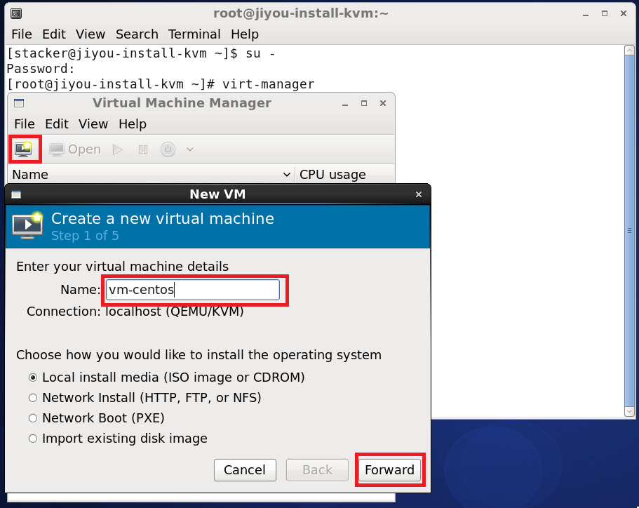

图4 创建新的虚拟机

>* 要注意的是，虚拟机名字，与虚拟机的`hostname`是两个概念。虚拟机名字只是用于virt-manager的管理不同虚拟机。虚拟机的`hostname`是给虚拟机内部的操作系统使用。而虚拟机的`hostname`主要用于网络主机名的识别。类似人的小名与学名，小名一般在家里面使用，学名适合在学校使用。

>* 建议安装虚拟机时，将虚拟机名字与虚拟机的`hostname`设为一致。设置`hostname`位于《[附录 安装CentOS 6.5 Linux操作系统](./install-centos.md)》**设置主机名**小节。

## Step 2 选择ISO文件

### 第一步 选择iso文件时，点击Browse按钮：

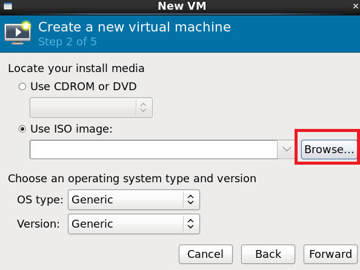

图5 选择iso文件

### 第二步 点击Browse Local按钮：

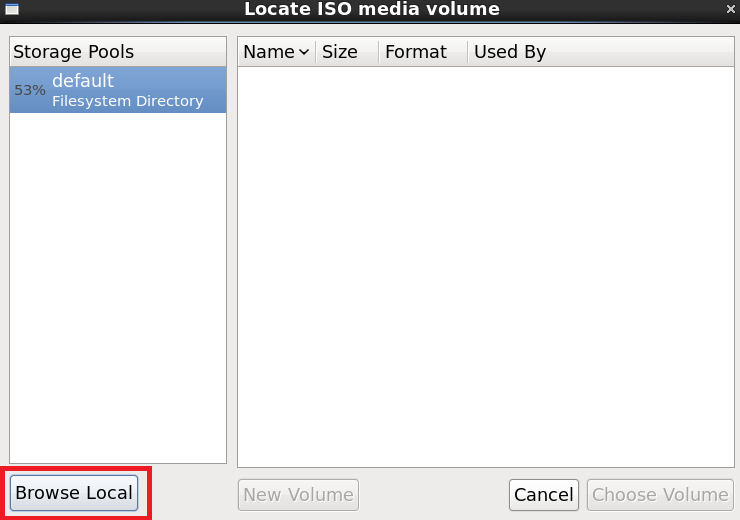

图6 选择本地文件系统

### 第三步 点击File System项：

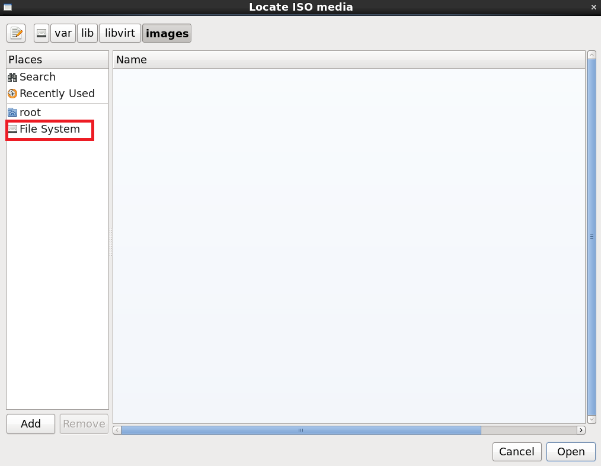

图7 选中File System

### 第四步 选中/opt/目录

图8 选中并且进入/opt/目录

###　第五步 选择CentOS iso

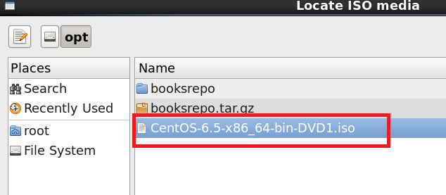

图9 选择CentOS DVD

### 第六步 成功选中

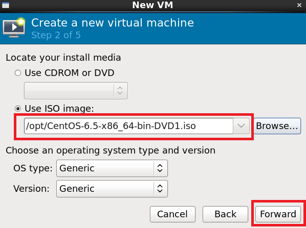

图10 选择成功

然后点击Forward。

## Step 3 设置内存与VCPU

根据物理机的情况设置内存与VCPU。一般而言，做实验使用512MB~1024MB内存，1个VCPU足够使用。设置好之后，点击Forward继续。

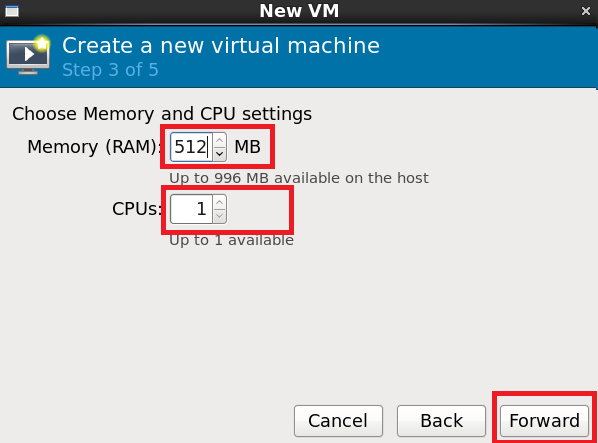

图11 选择内存及VCPU

## Step 4 创建磁盘

根据物理磁盘空间，及实际情况设置虚拟机磁盘大小。一般8G足够可用。如果虚拟机空间不足，后面可以创建虚拟磁盘挂载给虚拟机使用。设置成功之后，点击Forward继续。

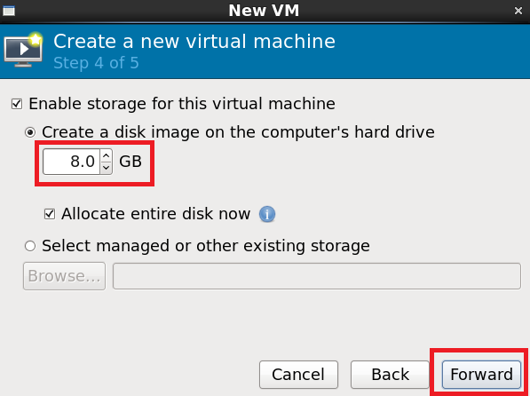

图12 创建磁盘

## Step 5 创建虚拟机

当前面步骤都完成之后，点击Finish将会创建虚拟机：

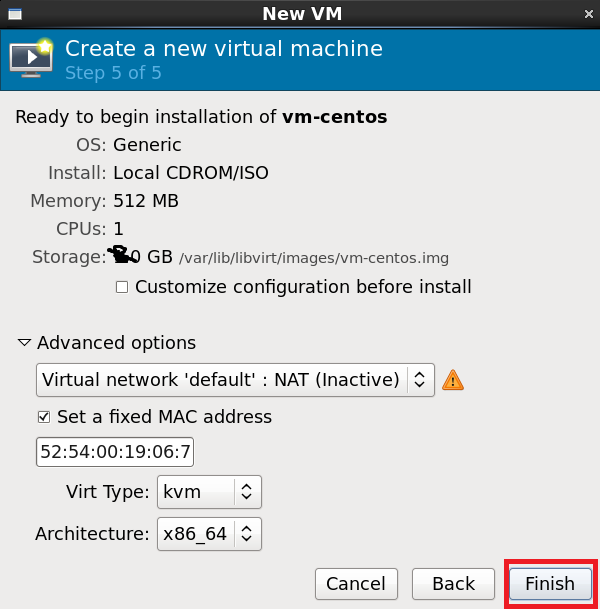

图13 创建虚拟机

##　Step 6 创建成功

当弹出如图14，说明创建成功：

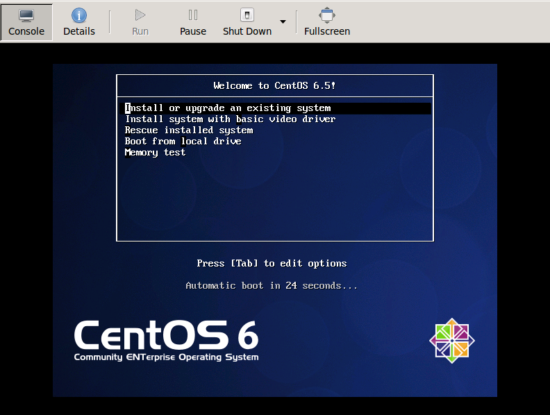

图14 创建虚拟机成功

## Step 7 虚拟机安装操作系统

请参照《[附录 安装CentOS 6.5 Linux操作系统](./install-centos.md)》进行后续步骤的安装。

# 错误处理

在Step 5，点击Finish之后，有可能遇到图15所示：

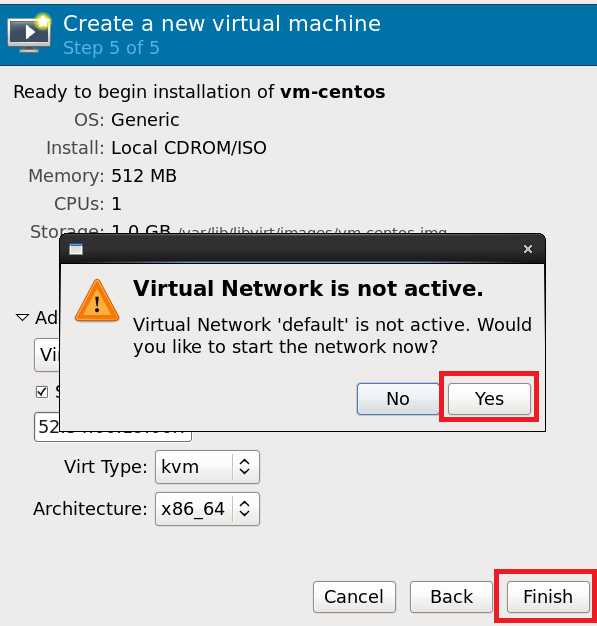

图15 点击Finish，弹出对话框，指明Virtual Network 'default'不可用

点击Yes之后，出现图16所示错误：

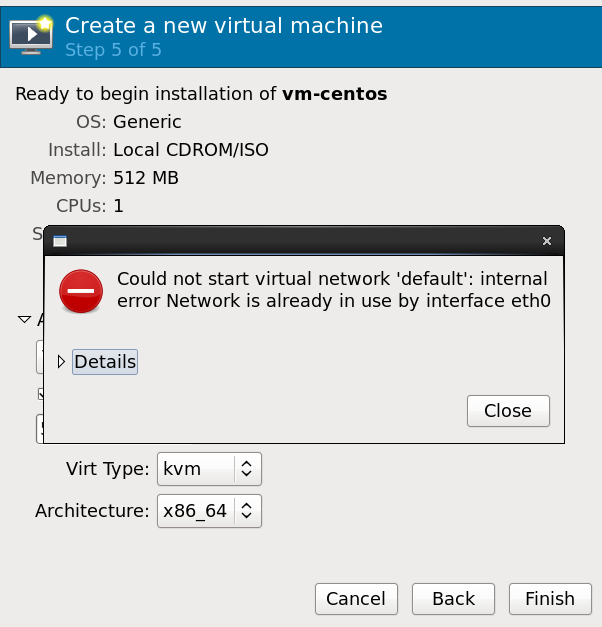

图16 缺省default网络不可用

## Step 1 Qemu Details
选中qemu，单击右键，选择Details:

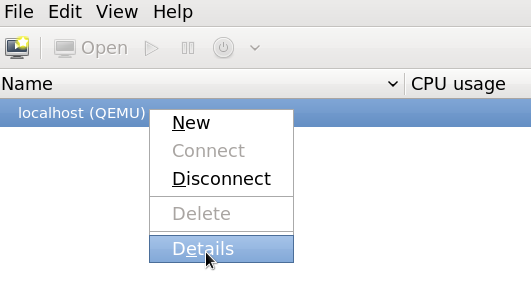

图17 Qemu Details

## Step 2 新建网络

选中Virtual Networks，再点击新建按钮。

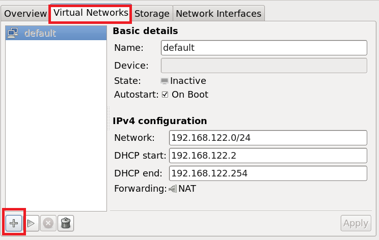

图18 创建新网络

## Step 3 步骤简介

点击Forward：

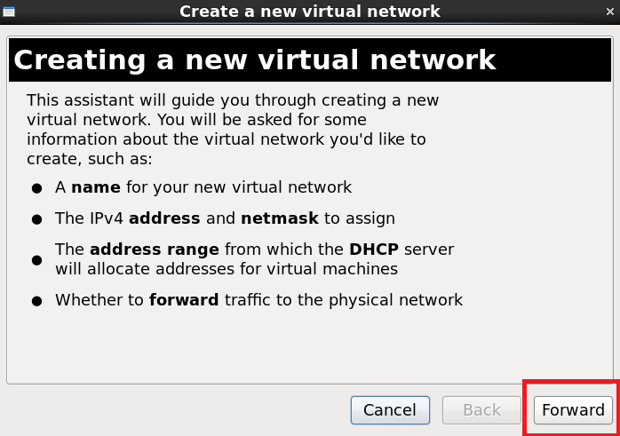

图19 显示大致步骤

## Step 4 设置网络名

首先输入网络名，只允许字母，下划线，数字。然后点击Forward：

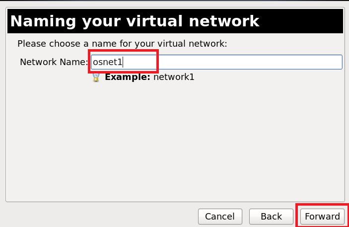

图20 设置网络名

## Step 5 设置网段

如果以前没有创建过网络，那么使用默认提供的网段，否则请输入一个不重复的网段。然后点击Forward：

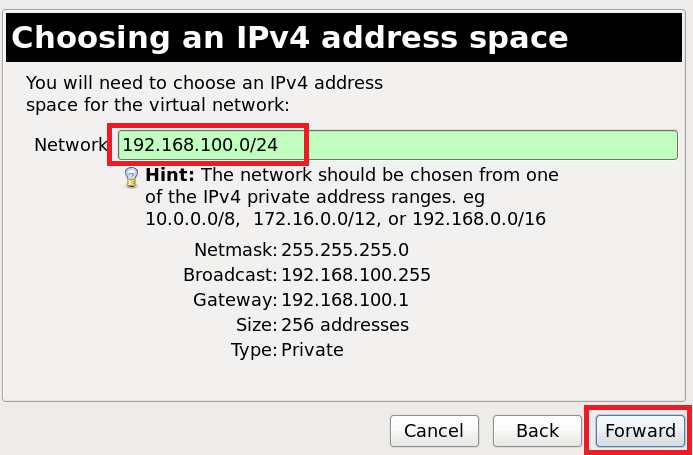

图20 设置网段

## Step 6 设置DHCP

接下来会要求设置DHCP，一般而言，使用默认即可，如果后期虚拟机数量较大，比如200个以上，请将起始IP改小点，并且注意网段与之前的设置一致。然后点击Forward：

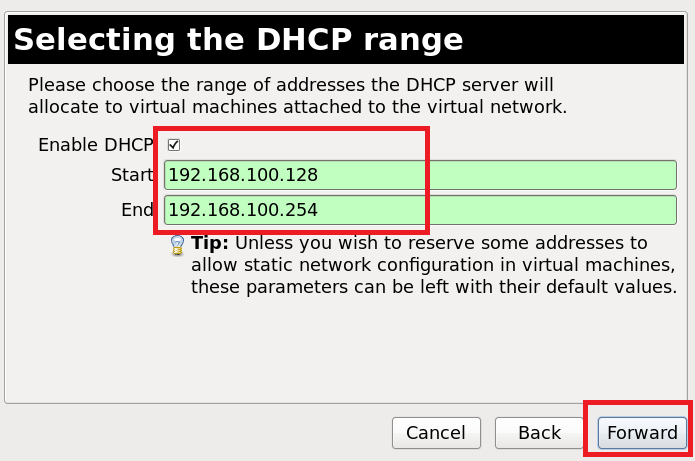

图21 设置网络IP

##　Step 7 网络类型

选择isolated network，请不要选择第二种类型（需要关掉ethx网卡）。

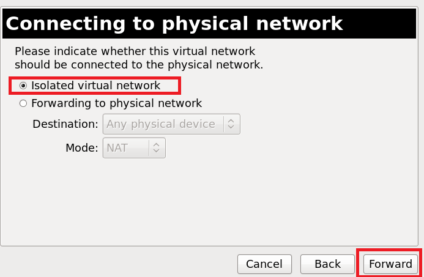)

图22 选择网络类型

##　Step　8 创建网络

点击Finish按钮：

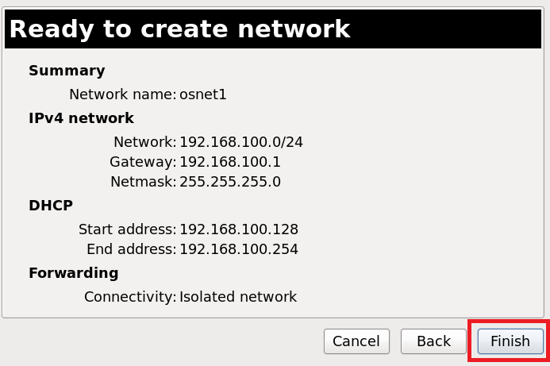

图23 创建网络

##　Step 9 重新选择网络

返回出错UI界面，点击Cancel按钮：

图24 点击Cancel按钮

**重新新建虚拟机**，并且重新进入如图25界面，选择新建的网络名，点击Finish按钮：

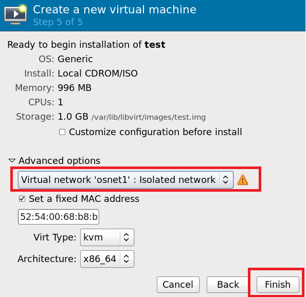

图25 选择新建网络

##　Step　10 安装操作系统

当弹出如图14，说明创建成功：

图26 创建虚拟机成功

请参照《[附录 安装CentOS 6.5 Linux操作系统](./install-centos.md)》进行后续步骤的安装。
