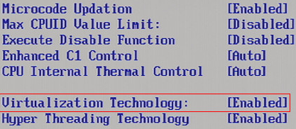

第一章 由零开始
==========
很高兴能够从这里开始，无论之前是否接触过OpenStack，或者Linux，哪怕只是听说过云计算。在这里，心里默念几遍“欲速则不达”，非常必要。让心开始静下来，准备开始。

如果读者只是准备利用Windows上的虚拟机搭建OpenStack，可以直接阅读第三章《VirtualBox及其使用》。本章所介绍的知识为利用Linux环境创建虚拟机。

再次重申：
>* 本章节进行的操作都是为了在**真实的Linux物理机**环境上操作虚拟机，请不要在Windows上搭建虚拟机仿真本章实验及操作。
>* 如果有支持VT的物理机可供安装Linux系统，建议从本章开始阅读。
>* 如果读者使用的是Windows环境，请从第三章开始。

# 1.1 开启VT
由于本章所使用的环境都是在真实的物理机上操作，首先要检测的是物理机是否支持VT。

虚拟化技术（Virtualization Techonology, VT），不同的厂商对于虚拟化技术称呼不同，Intel命令为Intel-VT，而AMD称之为AMD-V。本书中统称为VT。

检测是否支持VT，最简单也是最直接的方法，即是启动系统时，进入BIOS，打开CPU选项卡，确保VT处于Enabled状态。如果处于Disabled状态，请务必更改为Enabled状态。正确状态如下图所示：

图1.1 BIOS中开启VT

如果没有在BIOS中找到此选项，或者不知道如何开启，请参考以下建议，如果已成功开启，请跳过此建议。

>* 不同的BIOS对于VT的显示并不相同，有的显示为VT，有的显示为Virtualization，应该注意辨识。

>* 如果在BIOS中，没有发现Virtualization字样，应该查询相应CPU型号，以确认使用的CPU是否支持虚拟化。如果BIOS中虚拟化并没有开启，安装KVM之后，KVM模块仍然不能使用。因此，**应该必须保证**VT被开启。

>* 如果在BIOS中没有找到VT信息，一种检测CPU是否支持VT的方法是通过命令检测，如果没有任何输出，则表明不支持VT。如果有输出，则表明CPU支持VT，应至BIOS中查找VT选项，并确保开启。

		egrep -o "(vmx|svm)" /proc/cpuinfo

>* 除了此项需要设置之外，如果发现**VT-d Tech**选项，也应该将此项开启。VT-d技术表示CPU支持直接I/O访问的虚拟化技术。此项属于加分项，如果没有找到，也并不影响。

# 1.2 安装CentOS

关于CentOS的安装，被移动至了**《[附录 安装CentOS 6.5 Linux操作系统](./appendix/install-centos.md)》**。请参考此步骤进行CentOS 6.5的安装。

**特别提醒**
>* 物理机的安装，在**服务器类型**一处，本章请选择**Desktop**。如图1.2所示。
>* 如果对于CentOS Linux不是非常熟悉，请务必严格参考附录安装步骤。

图1.2 服务器类型选择Desktop

本书所有的实验都将基于Desktop类型。为了后续章节实验的顺利进行，请务必选择此选项且不要做额外配置。

>* 安装好CentOS 6.5系统之后，为了后续步骤能够正常进行，**不要**配置其他源或者执行`yum update`。

# 1.3 配置离线源

为了实验正常进行，以及更好的解决依赖问题，已经提供了会用到的所有的离线源。为了使本书所有的实验能够正常运行，请按以下步骤设置离线源。

## Step 1 下载源

本书会用到的所有的离线源，均放置于[百度云](http://pan.baidu.com/s/1gdzixz1)（http://pan.baidu.com/s/1gdzixz1）中。首先下载此离线
源booksrepo.tar.gz，并且放置于/opt/目录。

>* 为了实验正常进行，请**务必**按照书中目录进行存放。

## Step 2 解压
首先切换至root用户：

		# whoami
		stacker     # 如果显示为root，而不用再执行`su -`
		# su -
		Password:   # 输入root用户密码。

利用root用户，运行如下命令：

		# cd /opt
		# tar zxf booksrepo.tar.gz
		# ls 
		booksrepo  booksrepo.tar.gz #此处为命令的输出结果。

## Step 3 建立源

建立离线源，首先需要移除旧有的源：

		# cd /etc/yum.repos.d
		# mkdir -p /root/saved.repo
		# mv *.repo /root/saved.repo

新建文件booksrepo.repo：

		# cd /etc/yum.repos.d
		# vim booksrepo.repo
		[booksrepo]
		name=booksrepo
		baseurl=file:///opt/booksrepo/
		gpgcheck=0
		enabled=1
		proxy=_none_

>* 对vim不熟悉的读者，当进入vim之后，按一下i就可以正常编辑啦。
>* 注意每一行的开头没有空格或者Tab。如果有，请删除多余的空格或者Tab。

## Step 4 更新源
接下来可以使用离线源：

		# yum clean all && yum makecache
		Loaded plugins: fastestmirror, refresh-packagekit, security
		Cleaning repos: booksrepo total
		Cleaning up Everything
		Cleaning up list of fastest mirrors
		Loaded plugins: fastestmirror, refresh-packagekit, security
		Determining fastest mirrors
		booksrepo                                                                                | 2.9 kB     00:00 ... 
		booksrepo/filelists_db                                                                   |  33 kB     00:00 ... 
		booksrepo/primary_db                                                                     |  55 kB     00:00 ... 
		booksrepo/other_db                                                                       |  38 kB     00:00 ... 
		Metadata Cache Created

具体输出可能会有所不同，但是只要看到有**Metadata Cache Created**则表明离线源创建成功。

# 1.4 安装KVM
KVM是整个OpenStack开源云的基石之一，可能说是最重要的一块。能熟练地使用KVM，云计算也就会了一半了。KVM主要的功能是能够在一个**Linux操作系统**上运行多个虚拟机。

>* Windows上无法安装KVM。KVM相当于Linux界的vmware。当然，它是开源且免费的。

## Step 1 检测yum
首先应该检测yum是否被正确配置。如果没有配置离线源，请返回上一节配置离线源。

		# yum makecache && yum search kvm
		Loaded plugins: fastestmirror, refresh-packagekit, security
		Loading mirror speeds from cached hostfile
		booksrepo                                                                                | 2.9 kB     00:00 ... 
		Metadata Cache Created
		Loaded plugins: fastestmirror, refresh-packagekit, security
		Loading mirror speeds from cached hostfile
		=============================================== N/S Matched: kvm ===============================================
		qemu-kvm.x86_64 : Userspace component of KVM
		xnba-kvm.x86_64 : xNBA loader for virtual guests

  		Name and summary matches only, use "search all" for everything.

配置正确将会看到相应输出，具体环境不同，可能输出不同。只要能找到qemu-kvm即是成功。

## Step 2 安装KVM，Libvirt，virt-manager

		# yum install -y kvm libvirt virt-manager
		......
		Complete!

如果出现**Complete!**则表明安装成功。

## Step 3 启动Libvirtd

		# service libvirtd start
		Starting libvirtd daemon:                                  [  OK  ]

如果出现**[OK]**则表明启动成功。

# 1.5 virt-manager

对于刚接触KVM的读者而言，建立虚拟机的使用virt-manager是最好的选择。请参考以下步骤使用virt-manager。

## Step 1 开启桌面终端

在CentOS 6.5**桌面环境**中，新开一个终端，如图1.3所示：

图1.3 在桌面环境新开终端

>* virt-mananger是带UI的程序，需要在运行在桌面环境中。利用ssh无法正常启动virt-manager。

## Step 2 切换至root用户

然后输入如下命令：

		# su -
		Password:   # 输入root用户密码。

## Step 3 启动virt-manager

		# virt-manager

图1.4 启动virt-manager

如果能够成功出现图1.4所示界面，表明virt-manager能够成功启动了。接下来就可以尝试创建一个新的虚拟机了。

# 1.6 创建虚拟机

详细地创建虚拟机的步骤，可以参考《[附录 virt-manager创建虚拟机](./appendix/virt-manager.md)》。