第3章  VirtualBox
========================
Windows上的虚拟机软件，免费又好用的，非VirtualBox莫属。本章中将介绍如何在VirutalBox安装、操作虚拟机。

#3.1 简介
VirtualBox是一款开源的虚拟机软件。Windows与Linux上都可以安装运行，现在由Oracle收购后更名为Orcale VM VirtualBox。具备友好的界面与易用性。不过VirtualBox本身并不是特别稳定，近来也在不断完善。

##3.1.1  下载
至VirtualBox官方下载地址：

	https://www.virtualbox.org/wiki/Downloads

选择合适的版本进行下载：

	VirtualBox platform packages. The binaries are released under the terms of the GPL version 2.
		VirtualBox 4.3.18 for Windows hosts  x86/amd64
		VirtualBox 4.3.18 for OS X hosts  x86/amd64
		VirtualBox 4.3.18 for Linux hosts
		VirtualBox 4.3.18 for Solaris hosts  amd64

如果是Windows，请选择VirtualBox x.x.xx for Windows hosts。此外，还需要安装VirtualBox扩展包：

	VirtualBox 4.3.18 Oracle VM VirtualBox Extension Pack  All supported platforms 

在当前网页页面找到类似链接，点击下载即可。

##3.1.2  安装
安装VirtualBox异常简单，只需要一路点击Next即可完成完装。唯一需要注意的是，在安装完成之后，找到所下载的扩展包：

	Oracle_VM_VirtualBox_Extension_Pack-4.3.18-96516.vbox-extpack

具体版本可能有所不同，找到此后缀文件，双击即可运行。

#3.2  安装虚拟机
### Step 1
安装好VirtualBox之后，双击图标运行，点击新建按钮：

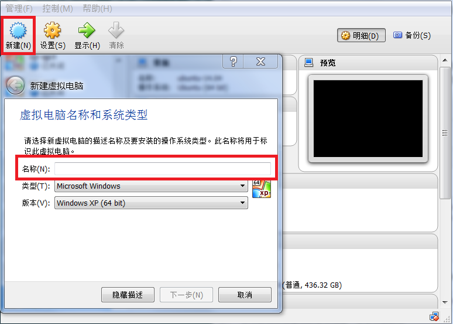

图3.1 点击新建按钮

### Step 2
输入虚拟机名，选择操作系统类型：

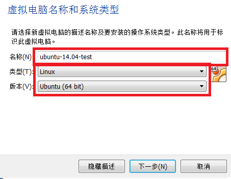

图3.2 输入虚拟机名，并且选择相应的操作系统。

**注意**此步骤非常重要，直接决定后面安装的系统是32位或是64位。所以一定要选对相应的版本。

### Step 3
设置虚拟机占用的内存，如下图所示：

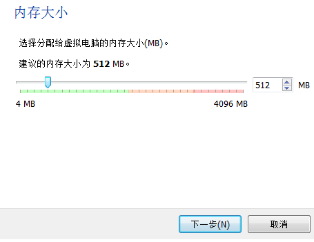

图3.3 设置虚拟机所用内存

### Step 4
创建虚拟机虚拟硬盘：

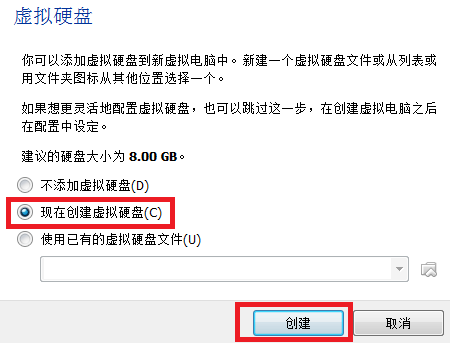

图3.4 添加虚拟机磁盘

### Step 5
选择磁盘类型，一般选择VDI格式，如果考虑通用性，也可以选择qcow2格式。一般情况下，默认使用qcow2格式。

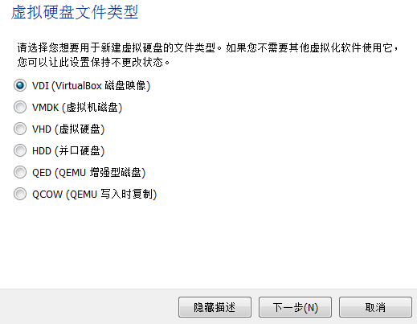

图3.5 选择磁盘格式

### Step 6
选择磁盘分配模式，有两种模式可供选择，一种是动态分配，不会立即占用分配空间，是按需增长。一种是固定分配，会立即占用空间，但是读写速度较快。一般而言，为了节省空间考虑，建议择动态分配。

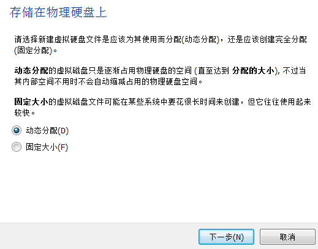

图3.6 选择磁盘创建种类

### Step 7
接下来选择磁盘创建的位置与大小，如下图所示：

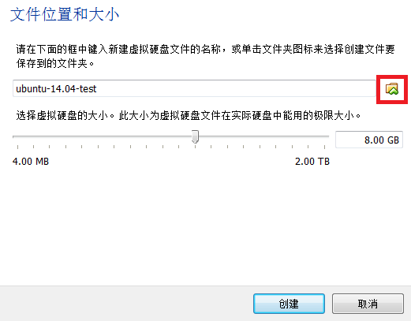

图3.7 选择磁盘创建的位置与磁盘的大小。

创建时，请点击右边的小角标，否则VirtualBox会将磁盘存放在它管理的文件夹中，不方便使用者管理磁盘。如下图，自定义磁盘存放路径：

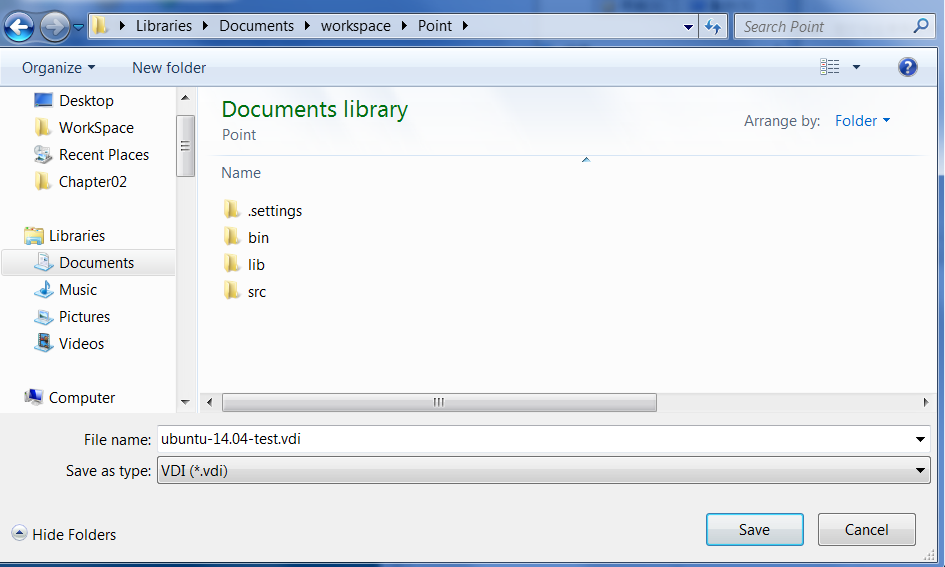

图3.8 自定义磁盘存放路径

选择好之后，可以调整磁盘空间的大小。

**注意**由于动态分配时，并不会立即占用空间，因此，在分配时可以将磁盘的大小选择偏大一些，以免虚拟机磁盘空间不足。

### Step 8
点击创建按钮之后，就可以在VirtualBox主页面上看到相应虚拟机的名字了，选中此虚拟机：

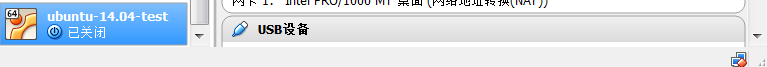

图3.9 选中新创建的虚拟机。

接着点击设置按钮，将会出现Settings菜单：

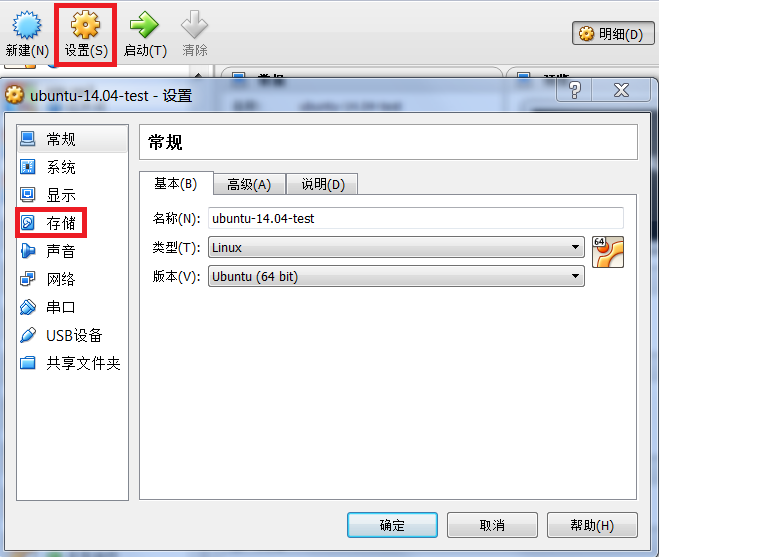

图3.9 设置新建虚拟机

### Step 9

接下来需要对存储选项进行设置，选中`存储`项之后，点击IDE控制项的没有盘片，再点击选择一个虚拟光盘：

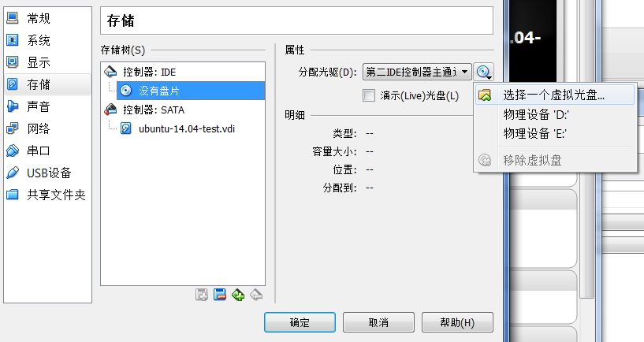

图3.9 选择ISO安装介质

选择完成之后，将会显示所选择的ISO文件名。

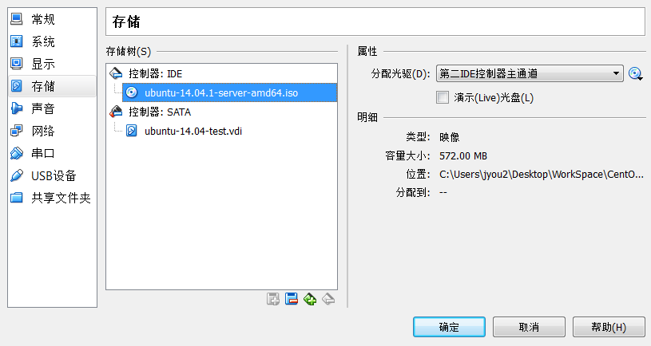

图3.10 选择ISO之后，显示其文件名

选择完成之后，点击确定按钮，设置完成。

### Step 10
设置完成之后，点击启动按钮，启动虚拟机：

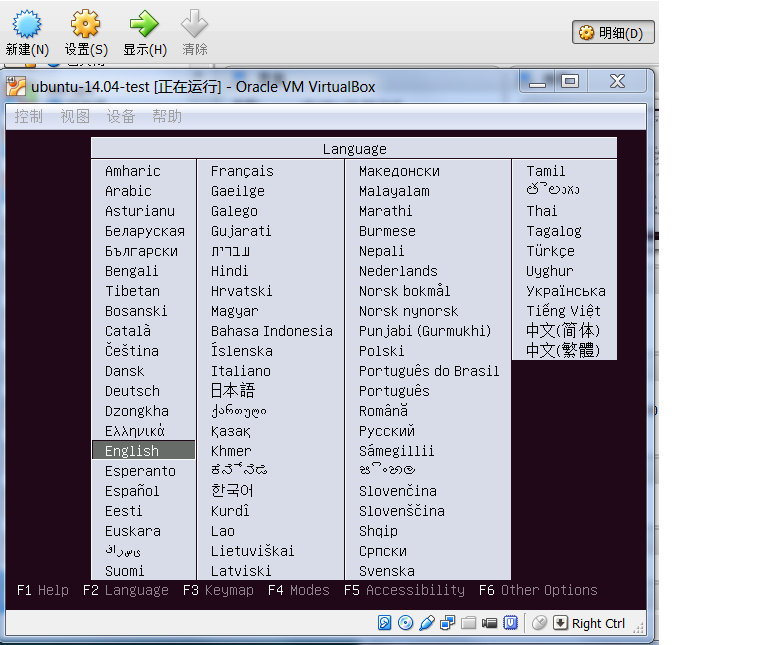

图3.11 启动虚拟机。

启动之后，则可以进行正常的安装步骤了。

#3.3 虚拟网络
当虚拟机运行成功之后，为了正常并且安装OpenStack，需要添加虚拟网络，一般而言，VirtualBox支持四种网络：

- NAT模式：最简单的实现虚拟机上网的方式，无需配置，默认选择即可接入网络。虚拟机访问网络的所有数据都是由主机提供的，访问速度较慢，和主机之间不能互相访问。

- Bridged Adapter模式：即网桥模式，可以为虚拟机模拟出一个独立的网卡，有独立的IP地址，所有网络功能和主机一样，并且能够互相访问，实现文件的传递和共享。（注： Windows 7系统选择网桥模式时，需要手动安装VirtualBox 的桥接服务驱动。在本地连接的属性选项中，选择“Microsoft网络客户端”点击安装，网络功能类型选择“服务”点击添加，选择从磁盘安装，找到驱动路径“Oracle\VirtualBox\drivers\network\netflt”，选择VBoxNetFlt_m文件安装完成。）
- Internal模式：即内网模式，虚拟机与外网完全断开，只实现虚拟机于虚拟机之间的内部网络模式，和主机之间不能互相访问，就相当于虚拟机之间架设了一个独立的局域网。
- Host-only Adapter模式：即主机模式，是所有接入模式中最复杂的一种，需要有比较扎实的网络基础知识才行。前面几种模式所实现的功能，通过虚拟机及网卡的设置都可以被实现。

在本文中，网卡1至网卡3使用Host-only模式，而网卡4使用网桥模式，配置如下图所示：

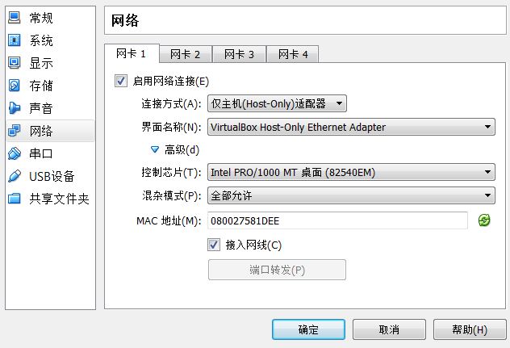

图3.12 网卡1~网卡3采用相同的配置。

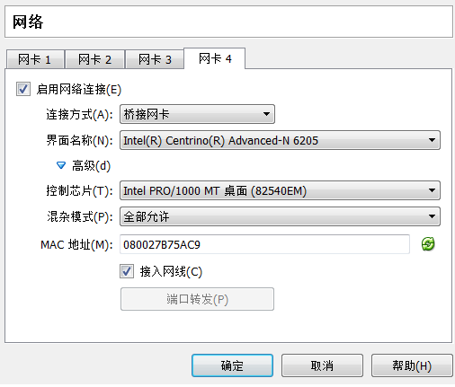

图3.13 网卡4的配置。

**注意**配置网卡需要在关闭虚拟机的情况下进行。在安装OpenStack时，就尽量不要使用网卡4。因为网卡4主要负责连接外部网络比如internet（实际上安装neutron时，有一个br-ex需要此网络，因此，尽量先预留给br-ex）。

#3.4 虚拟磁盘
如果需要给虚拟机添加虚拟磁盘，关闭虚拟机之后，点需设置菜单，进入存储项，选择`添加磁盘`按钮：

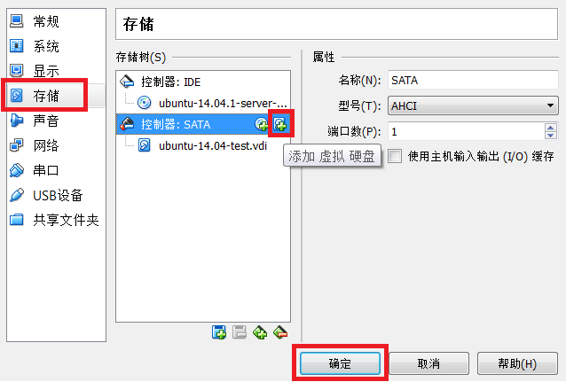

图3.14 添加虚拟磁盘

点击之后，会跳出对话框，可以选择新建磁盘或者已有磁盘。然后根据提示进行操作即可。

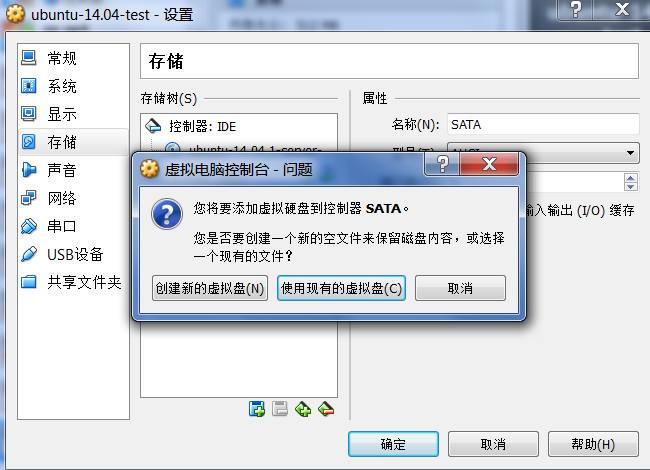

图3.15 添加虚拟磁盘对话框

创建完成之后，会看到相应的磁盘。

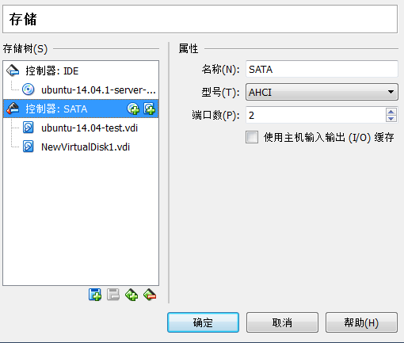

图3.16 添加虚拟磁盘成功

接下来，启动虚拟机，即可看到相应的磁盘，格式化之后，mount即可。

#3.5 快速创建虚拟机
利用VirtualBox可以轻松地创建虚拟机，可是如果每个虚拟机都去从ISO开始安装，岂不很麻烦，好在VirtualBox也提供了方法可以很轻松地创建虚拟机。

点击管理菜单，选择虚拟介质管理选项：

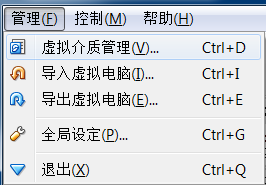

图3.17 管理虚拟介质

选中需要使用的虚拟机磁盘，然后点击复制按钮：

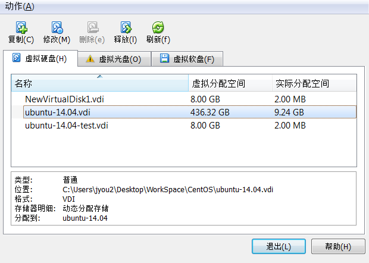

图3.18 复制虚拟介质

在弹出的对话框中，选择复制的虚拟介质存储位置：

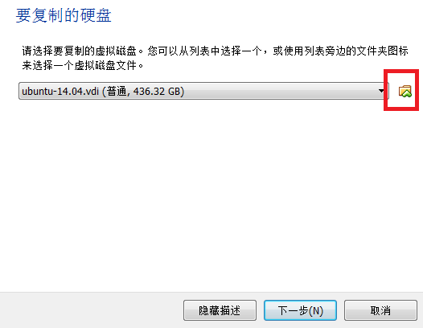

图3.19 选择复制的虚拟介质的存储路径

**注意**如果不选择存储路径，VirtualBox将会放置于默认路径中。

接下来按照新虚拟机的流程创建虚拟机，唯一不同的是，在创建磁盘时，选择已有磁盘即可。

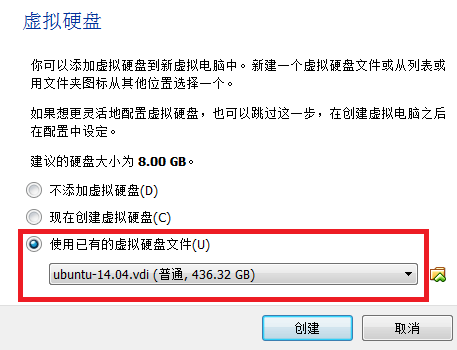

图3.20 注意选择正确的虚拟磁盘

#3.6 连接外网
由于第四个网卡使用的是桥接模式，因此，只要物理机能够正常上网，那么虚拟机也是可以正常上网的。所以不需要在虚拟机上做特别的配置。

当然，需要做的是，保证虚拟机启动之后，第四个网卡处于开启状态。

#3.7 小结

本章简要地介绍了VirtualBox创建虚拟机的流程，留下以下问给读者思考：

- 如何快速地创建虚拟机？
- 如何给虚拟机做快照？
- 如何删除虚拟机？如何删除虚拟机的所有文件？
- 一个虚拟机被删除之后，这个虚拟机名字，在新建时，还能否继续使用？

